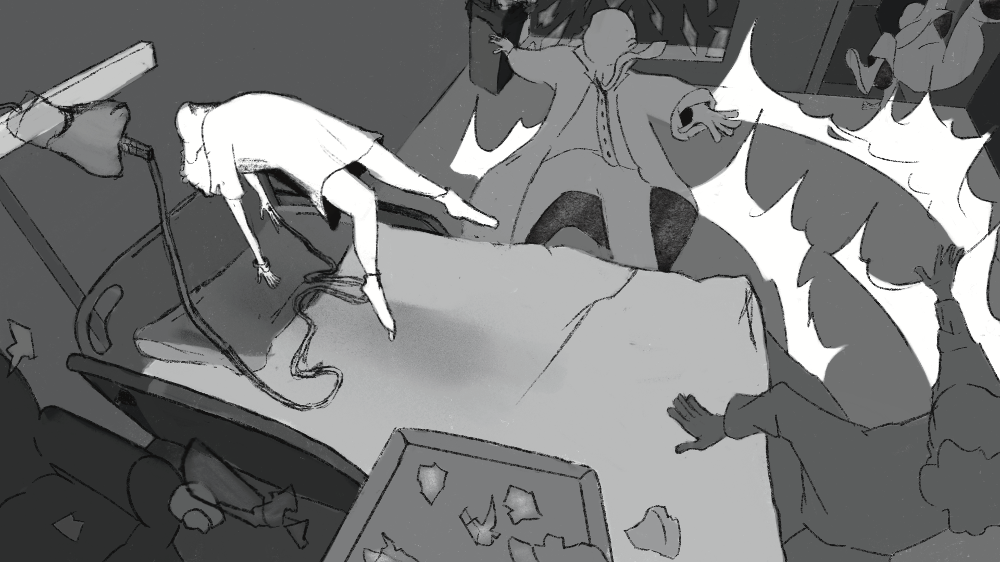
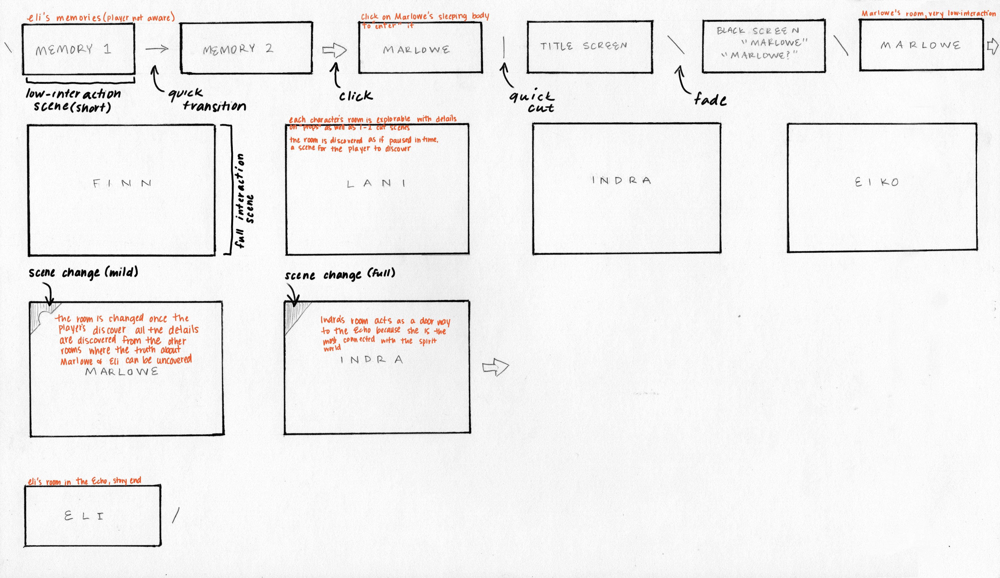
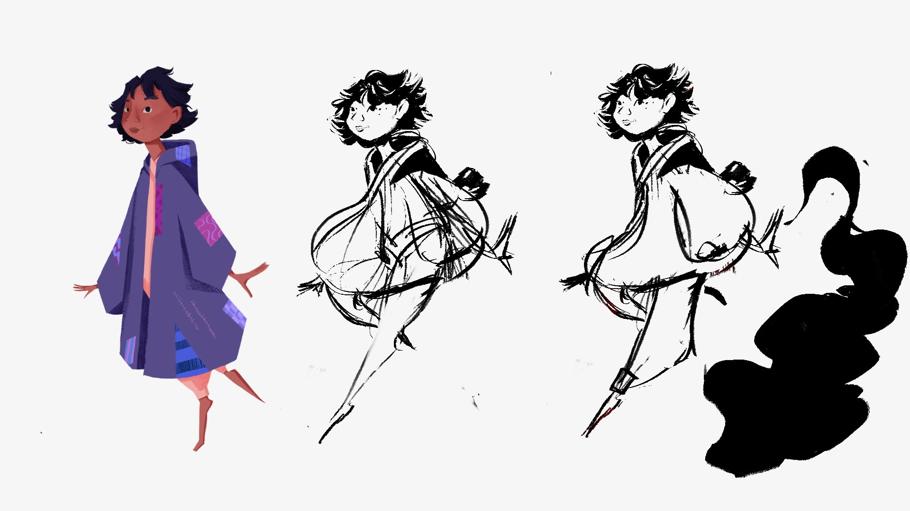
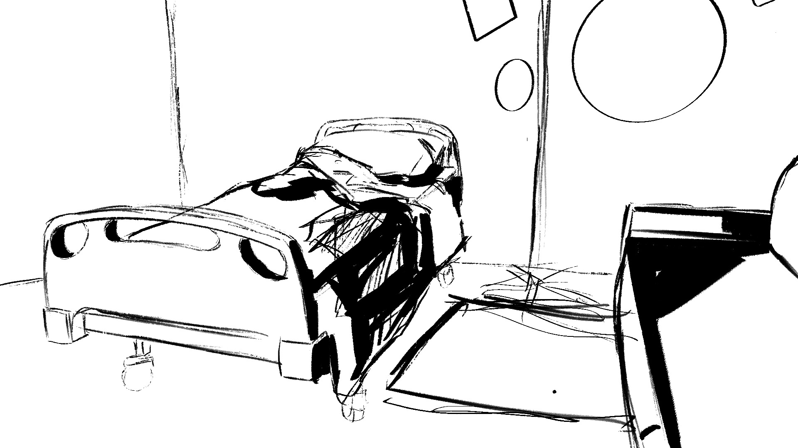
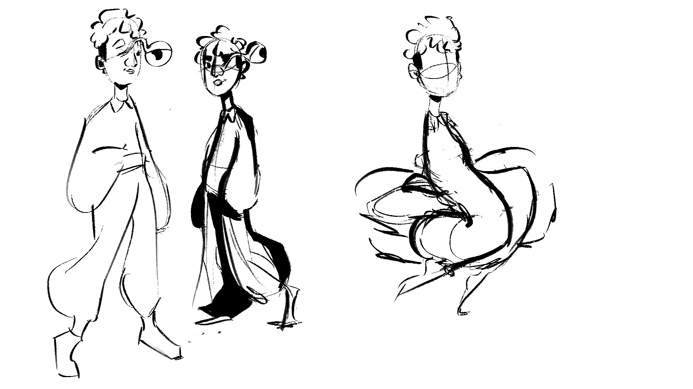
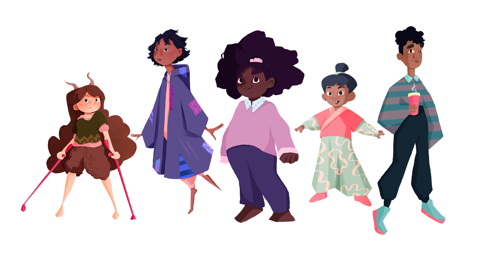

# --OUTPUT: WARD7 PROCESS

> For anyone reading this, please expect heavy spoilers for the plot of this project. This blog is serving as a record of our development process, including that of the story itself.

 

### CONTENTS
  Weekly Blog
  + [Week 1: 01.13.22 What are We Doing???](https://github.com/Invisii/Ward7/blob/master/Process/README.md#011322-what-are-we-doing-wk-1-update)

  

    
Other Minor Updates

  
  &nbsp;&nbsp;&nbsp;&nbsp;&nbsp;&nbsp;[01.10.22 Learning How to Speak](https://github.com/Invisii/Ward7/tree/master/Process#011022-learning-how-to-speak)
  

   
  
## MILESTONE GOALS

  
Iteration 1

  <ol>
    <li>completed character and environment designs
    <ul>
      <li>characters will be in their final forms with appropriate documentation</li>
      <li>environments will be sketched out in their final form with labels </li>
    </ul>
    </li>
    <li>rough thumbnails/storyboards of all scenes
      <ul>
        <li>rough drawings of all scenes will be completed</li>
      </ul>
    </li>
    <li>hand animation call sheet
      <ul>
        <li>a detailed list of all hand animations for the project will be completed</li>
      </ul>
    </li>
    <li>final plot structure
      <ul>
        <li>
          narrative map will be completed detailing:
          <ul>
            <li>overarching story</li>
            <li>how each “room” interacts with this story</li>
            <li>how players will uncover the story within each “room”</li>
          </ul>
        </li>
      </ul>
    </li>
    <li>
      functional prototype with:
      <ul>
        <li>multiple test scenes</li>
        <li>choices/interactions</li>
        <li>basic graphical effects (parallax, typing)</li>
      </ul>
    </li>
  </ol>

  
Iteration 2

  <ol>
    <li>
      interaction map
      <ul>
        <li>room by room list of all interactions (items, dialogue)</li>
      </ul>
    </li>
    <li>
      all character scene gestures
      <ul>
        <li>Every instance of a character will be roughed out so that the drawings are ready to be lined and colored</li>
      </ul>
    </li>
    <li>
      prop list
      <ul>
        <li>
          a list of all the props, the level of detail that they need to be completed in, and the room in which they will be placed will be completed
        </li>
      </ul>
    </li>
    <li>
      all hand animation roughs
      <ul>
        <li>any hand animation will have rough versions of each frame completed</li>
      </ul>
    </li>
    <li>
      all dialogue complete
      <ul>
        <li>write all of the text (dialogue, item descriptions/interactions, etc.)</li>
      </ul>
    </li>
    <li>functional prototype with first few polished scenes</li>
    <li>polished UI</li>
  </ol>

  
Iteration 3

  <ol>
    <li>
      all flat renders complete
      <ul>
        <li>All characters, scenes, and props will be rendered in flat colored and ready to be completed with a lighting pass</li>
      </ul>
    </li>
    <li>all hand animations complete</li>
    <li>
      all writing complete
      <ul>
        <li>transferred into Ink files</li>
      </ul>
    </li>
    <li>75% of scenes fully implemented</li>
  </ol>

 
   
 
## 01.19.22 Gettin' in the Groove! (Wk 2 Update)

Now that we have a sense of our characters and format, we're cranking on story this week. With background in mind, we established a map of rooms through which the player will uncover the story. For the scope of capstone, we're looking to make at least one room for each of our 5 characters. Each room will relate to the story of that character, as well as Eli.

On the assets front, this week we began reworking and finalizing character designs, and sketching environments to get a feel for each room.

On the Unity front, this week was used to set up more of the framework for our project. I've been building out the ability for dialogue/text to offer choices (which is greatly aided by Inky). Mostly this mean figuring out where and how to display choices within the UI I've already established. I've also been polishing the system to include typing effects.

For the most part, we've kept fairly on top of our weekly goals. Our biggest realization is that both of us function very well when we have some form of structure. So we spent this week developing structure and framework and getting into the groove, and building up momentum and a pattern of collaboration.

We also used this week to sit down and take a look at our overall scope per much of the feedback we received last semester and in class on Thursday. In summary, we scaled down a lot of our goals so we can try to work on depth rather than breadth, with the understanding that the project we end up with may only be the minimum viable product. We can continue to expand the game as needed as if it was released in early access or as if it was releasing DLC.

  
 
## 01.13.22 What are We Doing??? (Wk 1 Update)

This week is largely focused on the overall structure of our game in broad strokes. We've established the big picture story of our game (more detail in a second), and established that the idea is for the player to uncover this story and figure out what has lead to their current situation. To start, we're thinking of our story as a series of scenes we're calling echoes through which the player will experience the story. Here's a summary of that story we're looking at so far:

 

> Six years ago, someone went missing from St. Margaret's Hospital's Rare and Complex Diseases Ward. His name was Eli, a ten-year-old, and longtime patient of the ward founded by his father in hopes of assisting Eli's treatment. Though he had been stable before, a sudden turn for the worse brought Eli down further than he had been before. As his dad sat with him, preparing to say his goodbyes, Eli's powers manifestedand he and his father disappeared.

> In this world each person carries with them a spirit of sorts. When you experience a particularly intense emotion, you leave a small piece of this spirit behind, like fingerprints which persist until you draw your last breath. In your last moments, your spirit is pulled towards these fragments as if by a magnet. You are drawn almost unconsciously, collecting them back into yourself as you do reliving your most vibrant moments; and once you are whole, you exit through that place where your soul is most closely bound.

> In Eli’s moment of passing however, as the burden of forever leaving his father weighed upon him, what can only be described as magic erupted from his dying body. This supernatural surge created an Echo of the ward, a space of safety for Eli to be with his father, where his spirit would remain undrawn. Within the Echo, Eli stayed with his father and observed the world below, destined to watch but never interact. Time passed, and Eli grew older and more frustrated. He had created the Echo, he should be able to pass back into the outside world, right? Get some of the interaction he craves, and then just come right back into safety. 

> He opened a rift and passed through, but as he did he lost control. What Eli didn't account for was the fact that outside the Echo he was a raw spirit being drawn to a close. He was drawn to his old room, now inhabited by a young girl named Marlowe, and began collecting the pieces of his spirit which he had impressed into the room. In a fit of desperation, using perhaps his last semblance of sanity from the Echo, his disembodied spirit fled to the nearest safe haven from the pull of the end—Marlowe.

 
This is where the player begins, as Eli's spirit trapped unknowingly in Marlowe's body. The echo had provided a stasis for his spirit, but here back in the real world, the end is inevitable. Now it’s up to you to collect the memories to a story you don’t know in a body that isn’t yours. At this moment, our concept for gameplay is point-and-click storytelling where the player will enter each room (represented by a scene for each current patient) and examine objects in the room, collecting bits of story slowly and nonlinearly. As such, we are thinking of our game/story in terms of scenes. Our goals for this week are to solidify a number of these scenes so Calvin can begin storyboarding for the illustrations he'll be doing, and to create a prototype of a scene using Unity.

  

## 01.10.22 Learning How to Speak
Hello and welcome to the initial commit of Ward7! This project is being completed as part of my undergraduate degree in Creative Technology and Design (CTD). I am working with the lovely [Calvin Logan](https://www.calvinlogan.org/), a talented illustrator and storyteller.

Over the next coming weeks we will be further deciding our concept and storyline. For now, I have simply implemented connection to Inky for the basis of a dialogue system. Cheers!
