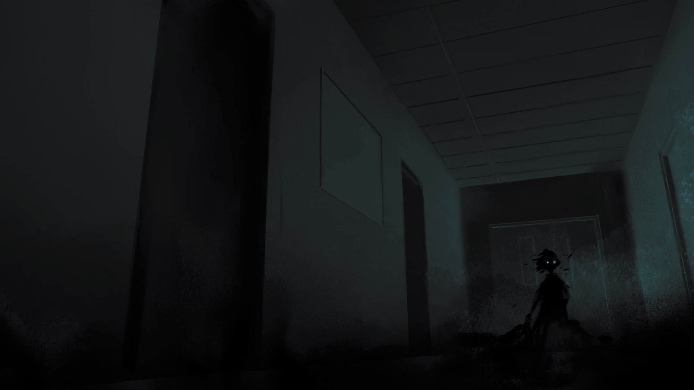

# --OUTPUT: WARD7 PROCESS

> For anyone reading this, please expect heavy spoilers for the plot of this project. This blog is serving as a record of our development process, including that of the story itself.

 

### CONTENTS
  Blog
  + [Week 1: 01.13.22 What are We Doing???](https://github.com/Invisii/Ward7/blob/master/Process/README.md#011322-what-are-we-doing-wk-1-update)
  + [Week 2: 01.19.22 Getting in the Groove!](https://github.com/Invisii/Ward7/tree/master/Process#011922-gettin-in-the-groove-wk-2-update)
  + [Week 3 &#8211; 4: 02.02.22 Worldbuilding](https://github.com/Invisii/Ward7/tree/master/Process#020222-worldbuilding-wk-3-4-update)
  + [Week 5: 02.09.22 First Blood](https://github.com/Invisii/Ward7/tree/master/Process#020922-catchin-up-wk-5-update)
  + [Week 6: 02.16.22 Detailing (Like a Car)](https://github.com/Invisii/Ward7/tree/master/Process#021622-detailing-like-a-car-wk-6-update)
  + [Week 7: 02.23.22 Connections](https://github.com/Invisii/Ward7/tree/master/Process#022322-connections-wk-7-update)
  + [Week 8 &#8211; 9: 03.09.22 Placeholders and Other Progress](https://github.com/Invisii/Ward7/tree/master/Process#030922-placeholders-and-other-progress-wk-8-9-update)
  + [Week 10: 03.16.22 Filling in the Gaps](https://github.com/Invisii/Ward7/tree/master/Process#031622-filling-in-the-gaps-wk-10-update)

  

    
Other Minor Updates

  
  &nbsp;&nbsp;&nbsp;&nbsp;&nbsp;&nbsp;[01.10.22 Learning How to Speak](https://github.com/Invisii/Ward7/tree/master/Process#011022-learning-how-to-speak)
  

   
  
## MILESTONE GOALS

  
Iteration 1

  <ol>
    <li>completed character and environment designs
    <ul>
      <li>characters will be in their final forms with appropriate documentation</li>
      <li>environments will be sketched out in their final form with labels </li>
    </ul>
    </li>
    <li>hand animation call sheet
      <ul>
        <li>a detailed list of all hand animations for the project will be completed</li>
      </ul>
    </li>
    <li>final plot structure
      <ul>
        <li>
          narrative map will be completed detailing:
          <ul>
            <li>overarching story</li>
            <li>how each “room” interacts with this story</li>
            <li>how players will uncover the story within each “room”</li>
          </ul>
        </li>
      </ul>
    </li>
    <li>
      functional prototype with:
      <ul>
        <li>in depth test scene</li>
        <li>interactions that lead to other mini scenes</li>
        <li>basic graphical effects (typing, maybe parallax)</li>
      </ul>
    </li>
  </ol>

  
Iteration 2

  <ol>
    <li>rough thumbnails/storyboards of all scenes
      <ul>
        <li>rough drawings of all scenes will be completed</li>
      </ul>
    </li>
    <li>
      interaction map
      <ul>
        <li>room by room list of all interactions (items, dialogue)</li>
      </ul>
    </li>
    <li>
      all character scene gestures
      <ul>
        <li>Every instance of a character will be roughed out so that the drawings are ready to be lined and colored</li>
      </ul>
    </li>
    <li>
      prop list
      <ul>
        <li>
          a list of all the props, the level of detail that they need to be completed in, and the room in which they will be placed will be completed
        </li>
      </ul>
    </li>
    <li>
      all hand animation roughs
      <ul>
        <li>any hand animation will have rough versions of each frame completed</li>
      </ul>
    </li>
    <li>
      all dialogue complete
      <ul>
        <li>write all of the text (dialogue, item descriptions/interactions, etc.)</li>
      </ul>
    </li>
    <li>functional prototype with first few polished scenes</li>
    <li>polished UI</li>
  </ol>

  
Iteration 3

  <ol>
    <li>
      all flat renders complete
      <ul>
        <li>All characters, scenes, and props will be rendered in flat colored and ready to be completed with a lighting pass</li>
      </ul>
    </li>
    <li>all hand animations complete</li>
    <li>
      all writing complete
      <ul>
        <li>transferred into Ink files</li>
      </ul>
    </li>
    <li>75% of scenes fully implemented</li>
  </ol>

 
   

 //Week 12: Textbox, Dialogue System
 //Week 11: UI Tests, Ribbon, Intro Anim

 
## 03.16.22 Filling in the Gaps (Wk 10 Update)

This week Calvin and I sat down and figured out all the assets and other bits of the story we had planned that we really wanted to implement. Since I'm mostly caught up on implementing systems and assets, I used some time this week to get going on the other mechanics we wanted to implement.

The first I had mentioned a number of weeks ago: the sticker book. Calvin mentioned that especially in hospitals for kids, they often hand out strange little square or circular stickers often with popular characters or cute little phrases on them. We want to design a bunch of them and hide them around our rooms like a little extra Where's Waldo hunt. Plus we can attach dialogue or some extra meaning to them for a fun extra bit of story.

In order to organize and interact with these elements beyond picking them up in the world, we also need a designated space to store them. So I also whipped up a journal of sorts. We can then organize them so each page corresponds to stickers related to different characters. We can also include some of our other close up objects like tarot cards, and maybe even implement something for the player to take notes for themselves if we ever manage to make this game complicated enough to warrant that.

Calvin also made two postcards (complete with handwritten backs), and I revisited an old design of mine to make it kind of match the vibes.

 |  | 
--- | --- | ---

 
 
## 03.09.22 Placeholders and Other Progress (Wk 8-9 Update) 

These last two weeks have been slower on the development front because I've been working on setting up the script with all of our written assets, and Calvin's been going along with writing.

This last week I finished implementing all of the placeholders so we can test implementing writing and get people to be able to click all the things to get a sense of our storytelling. And of course as Calvin gives me finished flats or shaded assets I've been tossing them in as well. The room above is Eiko's room with the flats implemented. The below is Finn's room with one of the placeholders. Finn's wall has a couple posters that you can click on to focus in on them and see them up close. While I'm waiting for Calvin to illustrate this focus object, I just put a png similar to the poster we have planned. In context, it looks really *really* funny.

Calvin also gave me an asset that needed to use a blending mode, and I quickly discovered that Unity doesn't quite support blending modes in an easy way. So using my learned knowledge of shaders from last week I whipped up a shader to work with this blending mode. It looks kinda wild in parallax.

 
 
## 02.23.22 Connections (Wk 7 Update)

This week is another iteration week! It came up super quickly following the last (or are we just running behind?). Regardless, for this week we made a ton of progress in the framework and systems for this game. Now that we're getting more than one room implemented, we needed a way to move between them. Our solution for this was to make a sort 2.5 dimension hallway with the door frames representing the different patient's rooms.

Since the hallway became kind of long, I also implemented a way to navigate forwards and backwards through it so Lani's room, which is at the far end of the hallway, would be more easily selectable. The hallway also has the same sort of parallax effect that the individual rooms do. The art for the hallways is fairly bare bones for now, but there's plenty of room for more detail we can put into each character's door later.

Also, after our first iteration, we got a lot of comments about communicating to the player what they can do. Mostly, they wanted some sort of indication that objects were selectable. So the bulk of the work this week was put into making objects highlight on hover. You can see the hover effect in the gif above. It has a slight glow on it that feels like it matches the ethereal vibe of the game.

Tbh, it was a pain to implement. I ended up making a shader that adds an outline with a glow effect on it, and hovering over objects that have an interaction swaps the object's material with this outlined one. To make it, I learned a bunch of shadergraph nonsense and made this abomination of a graph (I've never worked with shaders before, so this was a trip to learn and make):

As for art, this week, Calvin got sick, so we don't have much new to share :( Next week, I'd like to get placeholders for some missing objects in Finn and Marlowe's rooms, and to put in placeholders in Indra Dao, Lani, and Eiko's rooms so we can get a feel for the game as a whole.

 
 
## 02.16.22 Detailing (Like a Car) (Wk 6 Update)

Last week really felt like a major success. To see the art in Unity (though it was the unshaded prototypes, I'll get in shaded art when there's more of it to implement) really put into perspective the fact that we're actually making something and its real. That feels crazy.

This week, I took the nicely colored Marlowe's Room and implemented it into the parallax system we got going last week. (It's also been debugged and reverted back to Unity's old input system after a LOT of bugs the first go around. You can now click on objects without awful raycasting! Yay!)

I've mostly been implementing dummy dialogue, testing this new system, and making sure it works.

Calvin's been taking a crack at some of the objects you'll see up close. I had mentioned in a previous update about our idea of having some objects you click on offer a close up image of the object itself rather than just text in a box. In particular, with Marlowe's phone in her room having a little QR code you could actually scan to see the playlist she was listening to. As I've implemented Marlowe's zoomed out room this week, Calvin got me the first of these 'focused' objects as I've been calling them.
 
  | 
  --- | ---
  
 
 
 The other big piece of these "focused objects" is what's happening in Indra Dao's room. Indra sits at her bed with a deck of tarot cards. The tarot reading she's doing is greatly effected by Eli (see the Week 1 update including the story), and each of the cards will have a close up. Calvin started sketching those this week:
 
  |  |
 --- | --- | ---
 
## 02.09.22 First Blood (Wk 5 Update)

This week is iteration week which means we're ideally checking all the boxes under our goals for the first iteration. We've officially drawn the first blood on this project! Last week was maybe a bit of a departure from the focus on the functional product, but hey! Look! It works!

We have an initial build working with interactables and a parallax effect that just feels oh so juicy. It's a little bit buggy right now, as a result of trying to use Unity's new input system. Turns out that if you want to be able to click on something and trigger an event in the new system, you have to use raycasting (which I think we can all agree, is total overkill here).

We also put this in front of a few people who thought it had a lot of potential and we're pretty sure we're heading in the right direction.
Past this prototype, we discussed a few other minor mechanics I'm working on implementing. 

The first is a 'sticker book' which essentially acts as a collection. Since we have a sort of point and click vibe going on, we thought it might be good to hide stickers around the scenes for some extra lore.

The second is scenes which you have to 'paint on' with your mouse. We have several memories we want each of our characters to be connected to, but since their stories are localized within their rooms, we decided that some of the objects in these rooms will open a sort of secondary room to explore.
Since the vibe is 'uncovering memories' we really want to emphasize the actions that the player takes.

On the assets front, Calvin has made a ton of progress this week on the room bases, and we developed a comprehensive list of interactions in each of the rooms. 

  |  | 
| -------------- | ----------- | ------------|

Calvin also started making some more in depth renders of environments we'd like to explore including an initial render of Marlowe's room (which is where our intro/tutorial will take place) and a creepy render of Indra we'll have to find a place for (it's too good to pass up!)

 
  
 
## 02.02.22 Worldbuilding (Wk 3-4 Update)

We're getting to the point in this process that storytelling is shifting into our focus. We have a map of the story, but since this project is character driven, we spent the last two weeks really getting to know our characters and our world. Truly we've generated a lot more content than the player will ever see (or even need to see), but having the volume of work makes writing in the characters voices easier, as well as giving us a framework to develop the continuity of the story within.

The first piece of this is the setting - the rare and complex diseases ward on the 7th floor of St. Margaret's Hospital. Though the player won't be seeing much of the hospital itself outside of a hallway and several rooms, hospitals do have a clear sense of branding. In particular, patient rooms have whiteboards w/ branding, and doctors and nurses carry badges with branding as well. For this purpose, we set up a mini branding guide this week to use on any later assets which the hospital would have created.

The other big piece of this is the characters themselves. We know right away that in one of the scenes (Marlowe's Room), she has a phone on her side table. We want the player to be able to interact with the phone and see her lockscreen, with a background picture, and a little 'now playing' widget. We really like the idea of having the playlist icon be a QR code that the player can actually scan to go to the playlist that Marlowe is supposedly shuffling. So we made it. And then we made playlists for all of our other characters too. They're a good way to get into the characters heads, and they double as appropriate background music for when we ourselves are working with the stories of a particular character.

####Spotify Character Playlists
 >&emsp; &emsp;  [Lani](https://open.spotify.com/playlist/5HsyFK8FqdD5NjIwO0ECLS?si=ce04c8b25be9435d) &emsp; &emsp; |  &emsp; &emsp; [Marlowe](https://open.spotify.com/playlist/2TeNqWU51GWWd0fDqX2FbQ?si=180468a38e264314)  &emsp; &emsp; |  &emsp; &emsp; [Eiko](https://open.spotify.com/playlist/2FFQOYytevlcujhiP31S42?si=0379efdcbae7476c)  
>&emsp; &emsp; [Indra](https://open.spotify.com/playlist/3mcgJ9xPE0kagkLvGBJ2Rn?si=4832785077504b96) &emsp; &emsp; | &emsp; &emsp; [Finn](https://open.spotify.com/playlist/75GOaKFz32emCs9q6tboMZ?si=70181024397e44a8) &emsp; &emsp; | &emsp; &emsp; [Eli](https://open.spotify.com/playlist/3iZoNL9B76iFDlrCJsuDpx?si=d69320134a3749cc)

As per usual, Calvin has also done a ton of more asset work this week (I should probably just reserve the bottom of this dev blog for sharing his lovely art!) This week we have some blocked in versions of the sketches, as well as some visual style tests for the stylization, and some more concrete blocks and shading in Finn's Room (which we're building into our prototype for next week!)

 | 
 ----- | ----- 

  
 
## 01.19.22 Getting in the Groove! (Wk 2 Update)

Now that we have a sense of our characters and format, we're cranking on story this week. With background in mind, we established a map of rooms through which the player will uncover the story. For the scope of capstone, we're looking to make at least one room for each of our 5 characters. Each room will relate to the story of that character, as well as Eli.

On the assets front, this week we began reworking and finalizing character designs, and sketching environments to get a feel for each room.

On the Unity front, this week was used to set up more of the framework for our project. I've been building out the ability for dialogue/text to offer choices (which is greatly aided by Inky). Mostly this mean figuring out where and how to display choices within the UI I've already established. I've also been polishing the system to include typing effects.

For the most part, we've kept fairly on top of our weekly goals. Our biggest realization is that both of us function very well when we have some form of structure. So we spent this week developing structure and framework and getting into the groove, and building up momentum and a pattern of collaboration.

We also used this week to sit down and take a look at our overall scope per much of the feedback we received last semester and in class on Thursday. In summary, we scaled down a lot of our goals so we can try to work on depth rather than breadth, with the understanding that the project we end up with may only be the minimum viable product. We can continue to expand the game as needed as if it was released in early access or as if it was releasing DLC.

  
 
## 01.13.22 What are We Doing??? (Wk 1 Update)
![Five characters lined up. From left to right. First there is a short young girl with wild ginger hair, short horns, and bright pink crutch canes. She looks particularly fierce. Second there is a young teenager with short dark hair, wearing a purple robe who seems to be floating in the air. Third there is an older teenager with a huge mass of dark hair. She stands confidently and looks fairly comfortable. Fourth there is a tiny girl wearing clothes resembling a Kimono. She looks absolutely delighted and freespirited. Her dark hair is tied up into a bun on the top of her head. Last, there is an older teenage boy with large, baggy, comfortable clothing. He stands confidently, wearing a bold striped sweater and holding a coffee.](Images/wk1/v1-all.png "Left to Right: Finn, Indra, Marlowe, Eiko, Lani")
This week is largely focused on the overall structure of our game in broad strokes. We've established the big picture story of our game (more detail in a second), and established that the idea is for the player to uncover this story and figure out what has lead to their current situation. To start, we're thinking of our story as a series of scenes we're calling echoes through which the player will experience the story. Here's a summary of that story we're looking at so far:

 

> Six years ago, someone went missing from St. Margaret's Hospital's Rare and Complex Diseases Ward. His name was Eli, a ten-year-old, and longtime patient of the ward founded by his father in hopes of assisting Eli's treatment. Though he had been stable before, a sudden turn for the worse brought Eli down further than he had been before. As his dad sat with him, preparing to say his goodbyes, Eli's powers manifested and he and his father disappeared.    
> In this world each person carries with them a spirit of sorts. When you experience a particularly intense emotion, you leave a small piece of this spirit behind, like fingerprints which persist until you draw your last breath. In your last moments, your spirit is pulled towards these fragments as if by a magnet. You are drawn almost unconsciously, collecting them back into yourself as you do reliving your most vibrant moments; and once you are whole, you exit through that place where your soul is most closely bound.    
> In Eli’s moment of passing however, as the burden of forever leaving his father weighed upon him, what can only be described as magic erupted from his dying body. This supernatural surge created an Echo of the ward, a space of safety for Eli to be with his father, where his spirit would remain undrawn. Within the Echo, Eli stayed with his father and observed the world below, destined to watch but never interact. Time passed, and Eli grew older and more frustrated. He had created the Echo, he should be able to pass back into the outside world, right? Get some of the interaction he craves, and then just come right back into safety.   
> He opened a rift and passed through, but as he did he lost control. What Eli didn't account for was the fact that outside the Echo he was a raw spirit being drawn to a close. He was drawn to his old room, now inhabited by a young girl named Marlowe, and began collecting the pieces of his spirit which he had impressed into the room. In a fit of desperation, using perhaps his last semblance of sanity from the Echo, his disembodied spirit fled to the nearest safe haven from the pull of the end—Marlowe.

 
This is where the player begins, as Eli's spirit trapped unknowingly in Marlowe's body. The echo had provided a stasis for his spirit, but here back in the real world, the end is inevitable. Now it’s up to you to collect the memories to a story you don’t know in a body that isn’t yours. At this moment, our concept for gameplay is point-and-click storytelling where the player will enter each room (represented by a scene for each current patient) and examine objects in the room, collecting bits of story slowly and nonlinearly. As such, we are thinking of our game/story in terms of scenes. Our goals for this week are to solidify a number of these scenes so Calvin can begin storyboarding for the illustrations he'll be doing, and to create a prototype of a scene using Unity.

  

## 01.10.22 Learning How to Speak
Hello and welcome to the initial commit of Ward7! This project is being completed as part of my undergraduate degree in Creative Technology and Design (CTD). I am working with the lovely [Calvin Logan](https://www.calvinlogan.org/), a talented illustrator and storyteller.

Over the next coming weeks we will be further deciding our concept and storyline. For now, I have simply implemented connection to Inky for the basis of a dialogue system. Cheers!
